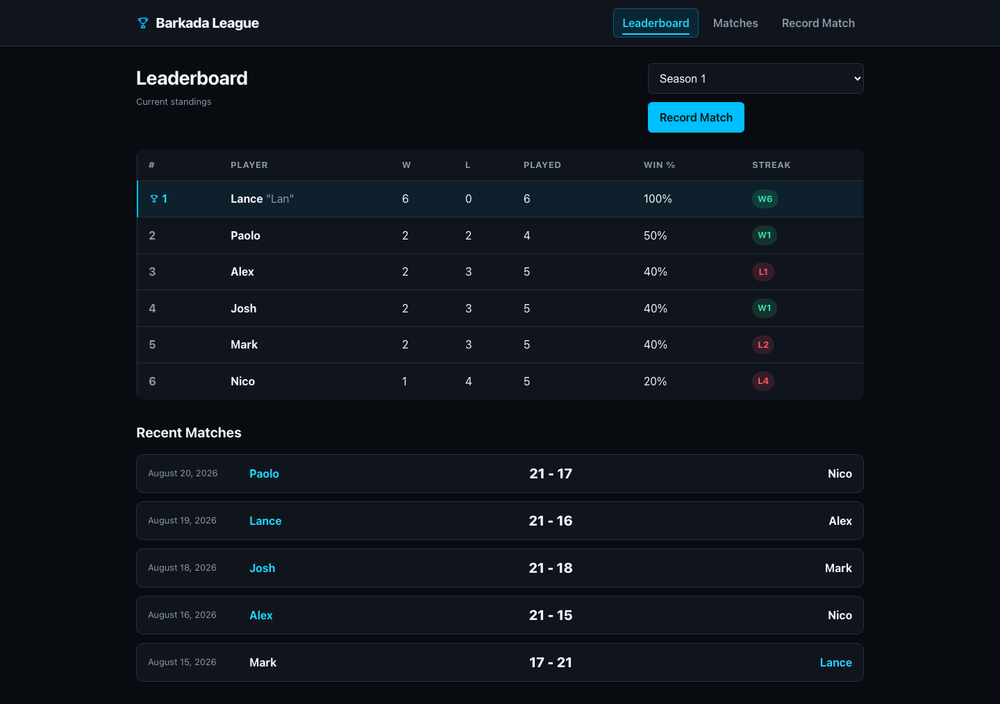
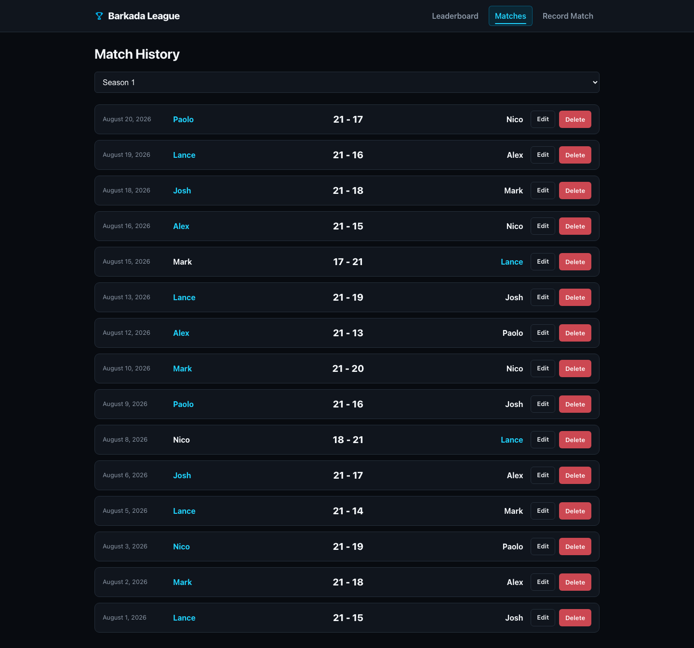
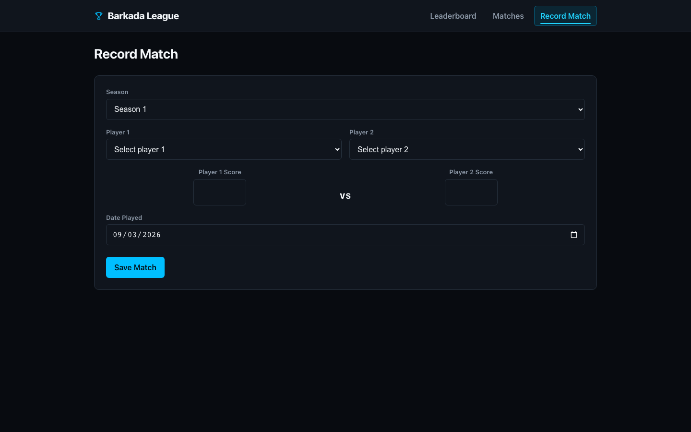
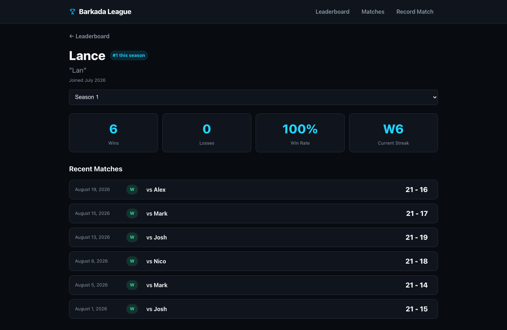
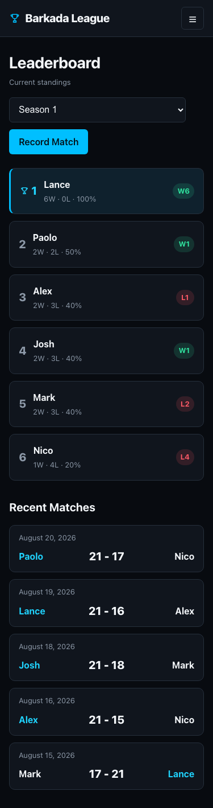

# Barkada League

[](AI-USAGE.md)

Most of the code in this project was written by **Claude Code** (Anthropic),
working from a spec and phase-by-phase direction I wrote and reviewed. Full
breakdown of what the AI did, where it got things wrong, and what I did myself:
[AI-USAGE.md](AI-USAGE.md).

Barkada League is a small web app for a group of friends (a "barkada") who
play the same 1v1 game and want to keep track of a season leaderboard
without doing the math by hand.

You record a match (who played, what the score was), and the app figures
out the winner, updates the standings, calculates win percentage, and
tracks each player's current win/loss streak — all from the raw match
history in the database, not from numbers typed in manually.

Built with:

- **React + Vite** (frontend)
- **Node.js + Express** (REST API)
- **PostgreSQL**, hosted on **Supabase** (Supabase is only used as the
  Postgres host here — the frontend never talks to Supabase directly, and
  there's no Supabase Auth/Storage/SDK involved)

## Overview

There are five screens:

- **Leaderboard** (`/`) — current season standings: rank, wins, losses,
  win %, current streak, plus a short list of recent matches.
- **Match History** (`/matches`) — every recorded match for the season,
  newest first, with edit/delete controls.
- **Record Match** (`/matches/new`) — form to log a finished match.
- **Edit Match** (`/matches/:id/edit`) — edit an existing match's
  players/scores/date.
- **Player Profile** (`/players/:id`) — one player's season stats and
  match history.

The important design decision here: **wins, losses, win %, rank, and
streak are never stored in the database.** They're calculated on every
request from the raw rows in the `matches` table. If you edit or delete a
match, the leaderboard changes automatically the next time you load it —
there's no "recalculate stats" button because there's nothing to
recalculate by hand.

## Project structure

```
Barkada_League/
├── src/                    # React frontend (Vite)
│   ├── pages/              # one file per route
│   ├── components/         # atoms/molecules/organisms
│   ├── services/api.js     # all fetch() calls to the Express API live here
│   ├── utils/               # client-side validation + formatting helpers
│   └── styles/
├── server/                 # Express backend
│   └── src/
│       ├── app.js          # express app, middleware, route mounting
│       ├── server.js       # starts the server
│       ├── db.js           # shared pg Pool
│       ├── routes/         # players.js, seasons.js, matches.js, leaderboard.js
│       └── utils/          # validation + shared leaderboard/streak math
├── database/
│   ├── schema.sql          # table definitions + constraints + indexes
│   └── seed.sql            # sample data (6 players, 1 season, 15 matches)
├── docs/screenshots/        # screenshots of the finished app
├── project/                 # weekly report + security checklist
├── journal/                  # weekly reflection
└── AI-USAGE.md
```

## Prerequisites

- Node.js (v18 or newer should work fine)
- A Supabase project (free tier is enough) — or any PostgreSQL database
  you can get a connection string for, since the backend just uses plain
  `pg` and doesn't depend on anything Supabase-specific

## Setup and installation

Clone the repo, then install both the frontend and backend dependencies:

```bash
npm install
npm run server:install
```

## Environment / configuration

There are **two** `.env` files — one for the frontend, one for the
backend. Neither is committed to git (see `.gitignore`), and both have a
matching `.env.example` you can copy from.

**Root `.env`** (frontend — tells React where the API is):

```
VITE_API_URL=http://localhost:3001
```

**`server/.env`** (backend — database connection):

```
PORT=3001
DATABASE_URL=postgresql://<your-supabase-connection-string>
```

You get the `DATABASE_URL` from your Supabase project dashboard under
**Connect → PostgreSQL connection string**. Don't put the real value in
`.env.example` — only in `.env`.

`VITE_API_URL` is not a secret (it's just a URL the browser is allowed to
know), but `DATABASE_URL` absolutely is — never commit it or paste it
somewhere public.

## Database setup

Run the SQL files against your Postgres database, in this order, using
the Supabase SQL Editor (or `psql`, or any Postgres client):

1. `database/schema.sql` — creates the `players`, `seasons`, and
   `matches` tables, their foreign keys, check constraints (no tied
   scores, no playing yourself, winner has to be one of the two players),
   and indexes.
2. `database/seed.sql` — inserts 6 players, one active season ("Season
   1"), and 15 sample matches so the app has something to show
   immediately.

After running both, you should have exactly 6 players, 1 season, and 15
matches.

## How to run

You need both the backend and frontend running at the same time, in two
separate terminals:

```bash
# terminal 1 — backend (http://localhost:3001)
npm run dev:server

# terminal 2 — frontend (http://localhost:5173, or whatever Vite picks)
npm run dev
```

Then open the frontend URL in your browser. Check `GET /api/health` on
the backend if something looks wrong — it returns
`{"status":"ok","database":"connected"}` when everything (server + DB)
is reachable.

## Features and usage

- Record a match by picking two different players, entering both scores
  (they can't tie), and a date. You do **not** pick the winner — the
  server figures out who won from the scores. This is on purpose: the
  frontend is never trusted to say who won.
- Edit an existing match from Match History. Changing the scores or the
  players recalculates the winner server-side, same as creating a new
  match.
- Delete a match from Match History (there's a confirmation step first).
  The leaderboard updates automatically since it's calculated fresh every
  time, not stored.
- Every player shows up on the leaderboard even if they haven't played
  any matches yet this season (they just show 0-0, 0%, no streak).
- The app works down to 375px wide (phone-sized) with no horizontal
  scrolling.

## API endpoints

All routes are prefixed with `/api`.

| Method | Route                              | What it does                                                                |
| ------ | ---------------------------------- | --------------------------------------------------------------------------- |
| GET    | `/api/health`                      | Checks the server + database connection                                     |
| GET    | `/api/players`                     | List all players                                                            |
| GET    | `/api/players/:id`                 | One player                                                                  |
| GET    | `/api/players/:id/stats?seasonId=` | One player's derived stats (wins, losses, win %, streak, rank) for a season |
| GET    | `/api/seasons`                     | List all seasons                                                            |
| GET    | `/api/seasons/active`              | The active season (404 if none)                                             |
| GET    | `/api/matches?seasonId=`           | List matches for a season, newest first                                     |
| GET    | `/api/matches/:id`                 | One match                                                                   |
| POST   | `/api/matches`                     | Create a match (server derives the winner from scores)                      |
| PATCH  | `/api/matches/:id`                 | Update a match (winner is recalculated)                                     |
| DELETE | `/api/matches/:id`                 | Delete a match                                                              |
| GET    | `/api/leaderboard?seasonId=`       | Full season standings, ranked, with streaks                                 |

A few validation rules worth knowing: scores can't be negative, can't be
equal, both players have to exist and be different from each other, and
the request is not allowed to send `winnerId` — the server always
calculates that itself and rejects the request if you try to send it.

## Screenshots

More screenshots (mobile views, component states, the delete
confirmation, error state, etc.) are in `docs/screenshots/`.

**Leaderboard (desktop)**



**Match History (desktop)**



**Record Match**



**Player Profile**



**Leaderboard (mobile, 375px)**



## Known issues and next steps

- CORS on the Express server is wide open (`cors()` with no config).
  Fine for a local/course project, not something you'd want as-is in
  production.
- The rate limiter is in-memory: counts reset on restart, and entries for
  IPs that stop calling are never removed. Fine for a small league, not for
  a busy public API.
- No authentication — this was an intentional non-goal for this project
  (see `BARKADA_LEAGUE_PROJECT_SPEC.md`), not an oversight.
- No screen to add/remove/edit players or seasons through the UI — right
  now that only happens through `seed.sql` or directly in the database.

See `project/REPORT.md` and `project/SECURITY-CHECKLIST.md` for more
detail on what's been built and verified.

## AI usage

[](AI-USAGE.md)

This project was built with heavy use of **Claude Code** (Anthropic) as a
pair-programming assistant — it wrote most of the implementation code across the
whole stack (schema, Express routes, React components and styling, debugging, and
this documentation), working from a spec and constraints I wrote and reviewing
each phase before moving on.

See **[AI-USAGE.md](AI-USAGE.md)** for the full account: what I asked for and what
came back on each piece of work, three cases where the AI got something wrong and
what I did instead, and which parts of the project are my own.
